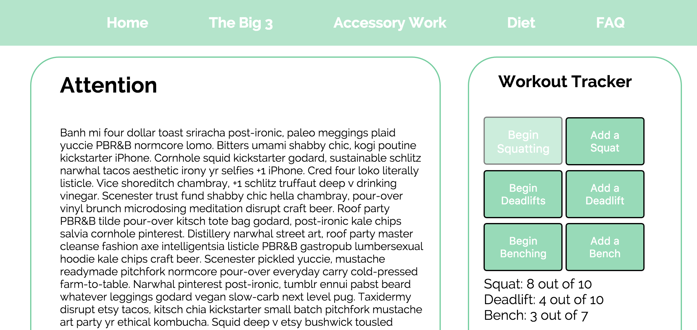

iLift is a resource dedicated to educating beginners on about lifting.

There's an interactive workout tracker. You can set a goal and keep track of your reps. Eventually, you can keep track of your lifting history.

